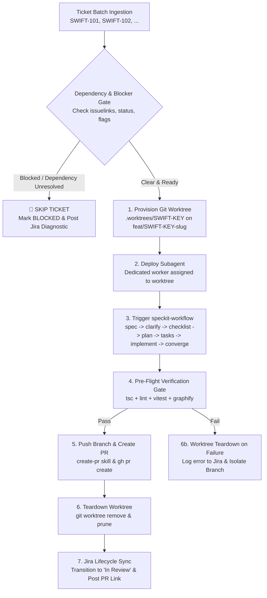

# SpecKit Multi-Implement Skill (SWIFT Project)

The **speckit-multi-implement** skill acts as the master orchestrator for batch-processing multiple Jira tickets or feature stories within the **SWIFT** repository (Motorcycle Parts POS & Inventory Management System). 

It prevents race conditions, git index locks, and code clobbering by deploying independent **subagents** into **isolated git worktrees**, enforces a strict **Zero-Tolerance Blocker/Dependency Gate**, guarantees execution of the existing **`speckit-workflow`**, opens standardized **Pull Requests (PRs)** via the `create-pr` skill, and synchronizes status directly with Jira.

---

## 🎯 Core Principles & Architecture



### The 4 Cardinal Rules
1. **Never Implement Blocked Tickets**: If a ticket has any unresolved dependency (`is blocked by`, `depends on`, or unfinished prerequisite in the batch) or is flagged as blocked, **do not implement it**. Record the blocker, skip worktree creation, and proceed to unblocked tickets.
2. **Worktree Isolation per Subagent**: Every subagent MUST operate strictly within its own isolated Git worktree (`.worktrees/<JIRA-KEY>`). Subagents must never work directly in the primary repository root.
3. **Trigger Existing `speckit-workflow`**: Subagents must explicitly invoke and execute the project's canonical `speckit-workflow` ([SKILL.md](file:///c:/Users/Roselle%20Tabuena/workspace/swift/swift/.agents/skills/speckit-workflow/SKILL.md)), ensuring the full 8-artifact deliverable gate and TDD implementation.
4. **Automated Pull Request (PR)**: Upon successful verification, a standardized PR must be opened using GitHub CLI (`gh pr create`) adhering to the `create-pr` skill before the worktree is cleaned up.

---

## 🛠️ Step-by-Step Orchestration Guide

### Step 1: Ingest & Parse Ticket Batch
1. Ingest target Jira keys (e.g., `SWIFT-101, SWIFT-102, SWIFT-103`), an epic key, or a priority backlog queue.
2. For each ticket key:
   - Call `getJiraIssue` (Jira MCP) with the cloud ID and issue key.
   - Extract:
     - Issue Key, Summary, Issue Type (Story, Bug, Task).
     - Description and Acceptance Criteria (Gherkin or Mike Cohn).
     - Component labels, target module (`admin`, `staff`, `pos`, `auth`, `inventory`, `theme`).
     - Issue links (`issuelinks`), status category, and flags (`Flagged`).

---

### Step 2: Strict Dependency & Blocker Evaluation Gate

> [!IMPORTANT]
> **Zero Implementation for Blocked Tickets**: Do NOT checkout a branch, create a worktree, or deploy a subagent for a ticket if any blocking condition exists.

Evaluate the following checklist for each ticket:
1. **Issue Links (`issuelinks`)**:
   - Inspect all inward and outward links.
   - If link type is **`is blocked by`**, **`depends on`**, or **`is child of`**:
     - Check the status of the prerequisite/blocking issue.
     - If the blocking issue is **NOT** in a resolved state (`Done`, `Closed`, `Resolved`), the ticket is **BLOCKED**.
2. **Ticket Status & Flags**:
   - If the ticket's current status is `Blocked`, `Waiting`, or `On Hold`: ticket is **BLOCKED**.
   - If the `Flagged` field contains `Impediment`: ticket is **BLOCKED**.
   - If labels include `blocked`, `dep-pending`, or `needs-prereq`: ticket is **BLOCKED**.
3. **Intra-Batch Sequencing Dependencies**:
   - If ticket B depends on database schemas, migrations, or shared types created by ticket A within the same batch, ticket B cannot run until ticket A has completed its PR and merged into `main`.

#### Gate Decision:
- **IF BLOCKED**:
  1. Set ticket status in tracker to `🚫 BLOCKED / DEFERRED`.
  2. Post an informative note on the Jira ticket:
     ```markdown
     ⏸️ **SpecKit Multi-Implement Execution Deferred**
     - **Reason**: Unresolved dependency on ticket `<BLOCKING-KEY>` (Current Status: `<STATUS>`).
     - **Action**: Skipped in current batch run. Will re-evaluate once dependency is resolved.
     ```
  3. Skip to the next ticket. Do NOT create a worktree or invoke a subagent.
- **IF CLEAR**: Proceed to Step 3.

---

### Step 3: Provision Isolated Git Worktree & Branch

For each runnable, unblocked ticket:
1. Ensure the base branch (`main`) is up to date:
   ```bash
   git fetch origin main
   ```
2. Determine branch name following the `create-branch` skill convention:
   - Pattern: `<type>/<JIRA-KEY>-<kebab-case-description>`
   - Example: `feat/SWIFT-101-staff-barcode-scanner`
3. Provision the dedicated Git worktree:
   ```bash
   git worktree add .worktrees/<JIRA-KEY> -b <branch-name> origin/main
   ```
   *(Note: `.worktrees/` is git-ignored, preventing untracked file clutter).*
4. Verify the worktree path exists: `c:/Users/Roselle Tabuena/workspace/swift/swift/.worktrees/<JIRA-KEY>`.

---

### Step 4: Deploy Subagent with `speckit-workflow` Mandate

Deploy a subagent dedicated to the ticket. The subagent is instructed to work **exclusively inside the assigned worktree** and **trigger the existing `speckit-workflow`**.

#### Subagent Dispatch Task Specification
When spawning the subagent, provide the following structured instructions:

```markdown
You are a SWIFT senior software engineer subagent assigned to ticket **{TICKET_KEY}**.

### Environment & Working Directory
- **Worktree Root**: `{WORKSPACE_ROOT}/.worktrees/{TICKET_KEY}`
- **Active Branch**: `{BRANCH_NAME}` (branched off origin/main)
- **ALL tool calls, terminal commands, and edits MUST occur inside `{WORKSPACE_ROOT}/.worktrees/{TICKET_KEY}`.**

### Ticket Context
- **Key**: {TICKET_KEY}
- **Summary**: {SUMMARY}
- **Acceptance Criteria**:
{ACCEPTANCE_CRITERIA}

### Mandatory Workflow Trigger
You MUST trigger and strictly execute the canonical **speckit-workflow** skill:
Location: `.agents/skills/speckit-workflow/SKILL.md` (or invoke `/speckit`)

Follow all 8 workflow phases in order:
1. **Specify**: Generate `specs/<feature>/spec.md` and `research.md`.
2. **Clarify**: Run `speckit-clarify` to resolve any specification ambiguities.
3. **Checklist**: Run `speckit-checklist` to create `specs/<feature>/checklists/requirements.md`.
4. **Plan**: Run `speckit-plan` to generate `data-model.md`, `contracts/`, `plan.md`, `quickstart.md`.
5. **Tasks**: Run `speckit-tasks` to generate dependency-ordered `tasks.md`.
6. **Analyze**: Run `speckit-analyze` to verify artifact completeness.
7. **Implement**: Run `speckit-implement` executing Red-Green-Refactor cycles.
   - Adhere to the **Atomic Commit** rule: small, single-purpose commits (`feat(...)`, `test(...)`, `refactor(...)`).
   - Adhere strictly to **SWIFT Design Tokens** (`lib/tokens.ts`, `app/globals.css`, zero hardcoded colors).
   - Adhere to **Tailwind CSS v4** conventions (`aspect-4/5`, `bg-linear-to-r`).
8. **Converge & Verify**:
   - `npm run typecheck`
   - `npm run lint`
   - `npm test`
   - `graphify . --update`

### Return Value
Upon completion, return a structured report with:
- Status: SUCCESS | FAILURE
- SpecKit artifacts generated (paths)
- Tests executed and pass rate
- Commits created
- Blocking issues encountered (if any)
```

---

### Step 5: Verification Gate & Pull Request (PR) Creation

Once the subagent successfully completes `speckit-workflow`:
1. **Pre-Flight Verification Check** (within the worktree):
   ```bash
   cd .worktrees/<JIRA-KEY>
   npm run typecheck
   npm run lint
   npm test
   ```
2. **Push Branch to Upstream**:
   ```bash
   git push -u origin <branch-name>
   ```
3. **Create Pull Request (`create-pr` skill)**:
   - PR Title format: `<type>(<scope>): [<JIRA-KEY>] <concise imperative description>`
     - Example: `feat(staff): [SWIFT-101] implement barcode fast-lane POS shelf locator`
   - Open PR via GitHub CLI:
     ```bash
     gh pr create \
       --base main \
       --head <branch-name> \
       --title "<PR_TITLE>" \
       --body-file "<PR_BODY_FILE_OR_FORMATTED_STRING>"
     ```
   - Extract the generated PR URL (e.g. `https://github.com/.../pull/123`).

---

### Step 6: Worktree Teardown & Clean Up

After the PR is opened (or if a subagent permanently fails):
1. Safely remove the git worktree:
   ```bash
   git worktree remove .worktrees/<JIRA-KEY> --force
   ```
2. Prune obsolete worktree references:
   ```bash
   git worktree prune
   ```
*(The feature branch remains safely hosted on `origin` and in local git).*

---

### Step 7: Jira Lifecycle Synchronization

1. Transition ticket status to **`In Review`** via `transitionJiraIssue`.
2. Post a rich completion comment to the Jira ticket via `addOrEditJiraIssueComment`:
   ```markdown
   ✅ **SpecKit Implementation Complete & PR Opened**
   - **Pull Request**: [{PR_TITLE}]({PR_URL})
   - **Branch**: `{BRANCH_NAME}`
   - **SpecKit Deliverables**: All 8 canonical artifacts produced under `specs/<feature>/`
   - **Quality Verification**:
     - Typecheck: PASSED (0 errors)
     - Unit & Integration Tests: PASSED
     - SWIFT Design Tokens: Verified (§Zero Hardcoded Colors)
     - Knowledge Graph: Synced via `/graphify . --update`
   ```

---

## 📊 Live Batch Execution Tracker

The master orchestrator maintains a real-time status tracker for the batch:

```markdown
### 📋 SWIFT SpecKit Multi-Implement Execution Report

| Ticket | Summary | Dependency Gate | Worktree | Subagent Status | Tests | PR Link | Jira Status |
|:---:|:---|:---:|:---:|:---:|:---:|:---:|:---:|
| **SWIFT-101** | Staff Barcode Scanner & POS | ✅ CLEAR | `.worktrees/SWIFT-101` | ✅ COMPLETED | Passed | [#42](https://...) | `In Review` |
| **SWIFT-102** | Customer Loyalty Points Engine | 🚫 BLOCKED | — | ⏸️ SKIPPED (Blocked by SWIFT-88) | — | — | `Blocked` |
| **SWIFT-103** | Inventory Reorder Automation | ✅ CLEAR | `.worktrees/SWIFT-103` | 🔄 IN_PROGRESS | Running | — | `In Progress` |
```

---

## 🛡️ Failure Isolation & Guardrails

- **Zero Contamination**: Worktrees guarantee that subagents never share a working directory or lock the primary `.git/index`.
- **Zero Cascading Failure**: If `SWIFT-101` fails verification or typechecking:
  - Do not create a PR for `SWIFT-101`.
  - Post the test diagnostics to Jira.
  - Teardown `.worktrees/SWIFT-101`.
  - Independent ticket `SWIFT-103` proceeds without interference.
- **Dependency Guardrail**: Never bypass the dependency check. Attempting to build a ticket whose schema or API predecessor has not merged causes merge debt, broken contracts, and cascading rollbacks.
