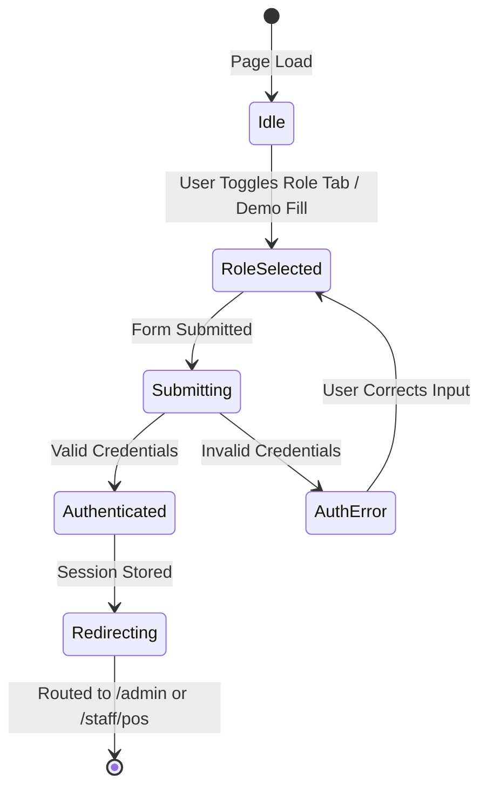

# Data Model & Entity Specifications: Role-Based Authentication Hub

**Feature**: Role-Based Authentication Hub & Login Switcher ([SIAA-8](https://the-three-devsketeers.atlassian.net/browse/SIAA-8))
**Status**: Completed

## 1. Domain Entities & TypeScript Types

### `PortalRole` (Enum / Union Type)
Defines the operational role and target application experience.

```typescript
export type PortalRole = "admin" | "staff";
```

### `UserSession` (Entity)
Represents the active authenticated identity.

| Field | Type | Description |
| :--- | :--- | :--- |
| `id` | `string` (UUID) | Unique user identifier |
| `email` | `string` | User email address |
| `name` | `string` | User display name (e.g., "Master Administrator", "Floor Cashier") |
| `role` | `PortalRole` | Assigned role determining access permissions |
| `terminalId` | `string?` | Optional hardware identifier for shop floor terminal tracking |
| `createdAt` | `string` (ISO 8601) | Timestamp when account was provisioned |
| `expiresAt` | `number` | Unix timestamp when current session token expires |

### `LoginCredentials` (Input DTO)
Form input payload submitted to the authentication handler.

```typescript
export interface LoginCredentials {
  email: string;
  password?: string;
  selectedRole: PortalRole;
  rememberTerminal: boolean;
}
```

### `AuthResult` (Response DTO)
Result returned from the authentication process.

```typescript
export type AuthResult =
  | { success: true; redirectTo: string; session: UserSession }
  | { success: false; error: string; code: AuthErrorCode };

export type AuthErrorCode =
  | "INVALID_CREDENTIALS"
  | "NETWORK_ERROR"
  | "USER_NOT_FOUND"
  | "ACCOUNT_LOCKED"
  | "UNKNOWN_ERROR";
```

### `DemoAccount` (Constant Model)
Pre-configured evaluation credentials.

```typescript
export interface DemoAccount {
  label: string;
  email: string;
  role: PortalRole;
  targetUrl: string;
  buttonLabel: string;
}

export const DEMO_ACCOUNTS: Record<PortalRole, DemoAccount> = {
  admin: {
    label: "Admin",
    email: "admin@swift.local",
    role: "admin",
    targetUrl: "/admin",
    buttonLabel: "Use Admin",
  },
  staff: {
    label: "Staff",
    email: "cashier@swift.local",
    role: "staff",
    targetUrl: "/staff/pos",
    buttonLabel: "Use Staff",
  },
};
```

---

## 2. State Transitions & Lifecycle



## 3. Storage Schema & Keys

- **Client LocalStorage**:
  - Key: `swift_terminal_role`
  - Values: `"admin"` | `"staff"`
  - Description: Persists default portal selection when "Remember this terminal" is checked.
- **Session Cookies**:
  - Key: `sb-access-token` / `swift-session-role`
  - Lifecycle: Session or Persistent (depending on terminal persistence checkbox).
