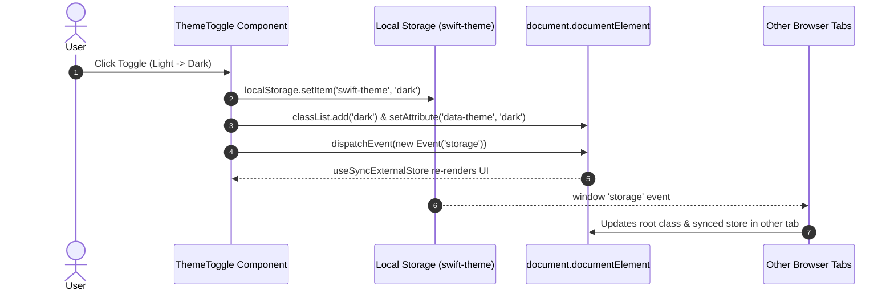

# Data Model & Schema: Global Light/Dark Theme Mode

**Feature**: STORY-1.4: Global Light/Dark Theme Mode with Zero-Hydration-Flicker Persistence (Jira: SIAA-11)
**Date**: 2026-10-07

## 1. Theme Domain Types

```typescript
/**
 * Supported Theme Modes in SWIFT
 */
export type ThemeMode = "light" | "dark";

/**
 * Default Theme Baseline
 */
export const DEFAULT_THEME: ThemeMode = "light";

/**
 * Storage Key for Persistent User Theme Preference
 */
export const THEME_STORAGE_KEY = "swift-theme";
```

## 2. Theme State & Storage Mapping

| Property | Type | Storage Target | Default | Purpose |
| :--- | :--- | :--- | :--- | :--- |
| `theme` | `ThemeMode` | `localStorage['swift-theme']` | `"light"` | User selected active color theme |
| `html.classList` | DOM Token List | Root `<html class="...">` | `""` | Contains `"dark"` when theme is dark |
| `html.data-theme`| DOM Attribute | Root `<html data-theme="...">` | `"light"` | Explicit theme indicator for CSS variable scoping |

## 3. DOM & State Synchronization Flow


