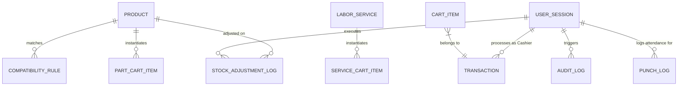

# Data Model: Domain Types & Reactive Store Entities

**Feature**: `Centralized Domain Models & Reactive Mock Data Engine`
**Ticket**: `SIAA-12`
**Date**: 2026-10-07
**Updated**: 2026-10-08

## 1. Domain Entities & TypeScript Definitions

### Product & Inventory (`lib/types/product.ts`)
```typescript
export type ProductCategory =
  | 'Brakes'
  | 'Drivetrain'
  | 'Fluids'
  | 'Ignition'
  | 'Engine'
  | 'Tires'
  | 'Suspension'
  | 'Electrical'
  | 'Accessories'
  | string;

export interface Product {
  sku: string;
  name: string;
  category: ProductCategory;
  stock: number;
  minThreshold: number;
  location: string; // e.g. "Rack A-01 / Shelf 2"
  cost: number;
  wholesale: number;
  retail: number;
  oem: boolean;
  model: string; // Motorcycle fitment or "Universal"
  brand: string;
  description?: string;
  imageUrl?: string;
}

export type MotorcycleModel =
  | 'Yamaha NMAX 155'
  | 'Yamaha Aerox 155'
  | 'Honda Click 125i/150i'
  | 'Honda ADV 160'
  | 'Suzuki Raider 150 Fi'
  | 'Universal'
  | string;

export interface CompatibilityRule {
  sku: string;
  model: string;
  yearRange?: string;
  notes?: string;
}
```

### Labor Services (`lib/types/service.ts`)
```typescript
export interface LaborService {
  code: string;
  name: string;
  bay: string; // e.g. "Bay 1 / Quick Bay"
  rate: number; // Flat rate labor in PHP
  duration: string; // e.g. "15 mins", "45 mins"
  description?: string;
}
```

### POS Cart & Orders (`lib/types/cart.ts`)
```typescript
export type PricingMode = 'retail' | 'wholesale';

export interface BaseCartItem {
  id: string;
  name: string;
  price: number;
  qty: number;
}

export interface PartCartItem extends BaseCartItem {
  type: 'part';
  sku: string;
  location?: string;
  retailPrice?: number;
  wholesalePrice?: number;
}

export interface ServiceCartItem extends BaseCartItem {
  type: 'service';
  code: string;
  bay?: string;
}

export type CartItem = PartCartItem | ServiceCartItem;

export interface CartTotals {
  subtotal: number;
  discountRate: number;
  discountAmount: number;
  total: number;
  itemCount: number;
}
```

### Checkout & Completed Transactions (`lib/types/transaction.ts`)
```typescript
export type TransactionPaymentMethod = 'Cash' | 'GCash' | 'Card' | 'Maya' | string;

export interface Transaction {
  id: string; // e.g. "TX-1041"
  timestamp: string; // ISO date string or formatted locale string
  cashier: string; // e.g. "Mike Morales"
  items: CartItem[];
  pricingMode: PricingMode;
  subtotal: number;
  discountRate: number;
  discountAmount: number;
  total: number;
  cashTendered?: number;
  change?: number;
  paymentMethod?: TransactionPaymentMethod;
}
```

### Pricing & Business Rules (`lib/types/pricing.ts`)
```typescript
export interface PricingRules {
  retailMarkup: number; // percentage, e.g. 35
  wholesaleMarkup: number; // percentage, e.g. 18
  aftermarketMarkup: number; // percentage, e.g. 40
  hourlyLaborRate: number; // rate in PHP, e.g. 450
}
```

### User Accounts & Session (`lib/types/auth.ts`)
```typescript
export type UserRole = 'Admin' | 'Cashier' | 'Mechanic' | 'Inventory Clerk';

export interface UserSession {
  id: number | string;
  name: string;
  email: string;
  role: UserRole;
  status: 'Active' | 'Inactive' | 'Suspended';
  permissions: string;
}
```

### Logs & Audit Trail (`lib/types/logs.ts`)
```typescript
export interface StockAdjustmentLog {
  id: string;
  timestamp: string;
  sku: string;
  type: 'Audit Adjustment' | 'Restock Inbound' | 'Damaged Goods' | 'Shrinkage';
  change: string; // e.g. "-2 Units", "+24 Units"
  reason: string;
  user: string;
}

export interface AuditLog {
  id: string;
  timestamp: string;
  user: string;
  action: string;
  ip: string;
}

export interface PunchLog {
  id?: string;
  date: string;
  staff: string;
  timeIn: string;
  timeOut: string;
  duration: string;
  status: 'On Shift' | 'Completed' | 'Break';
}
```

## 2. Entity Relationships


