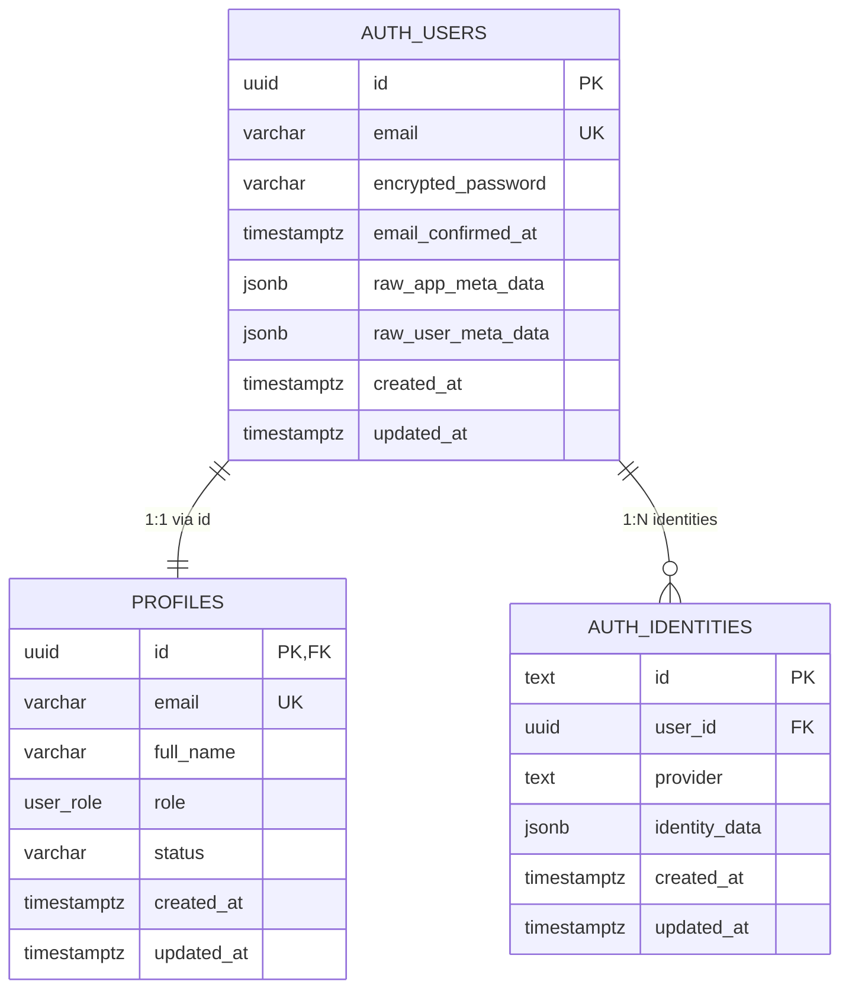

# Data Model & Schema Design: Supabase Auth Migrations, User Roles & Demo Seeding

**Feature**: Supabase Auth Migrations, User Roles Schema & Demo Seed Script  
**Feature Directory**: `specs/006-auth-migrations-seed`  
**Date**: 2026-10-08  
**Status**: Completed  

---

## Entity Relationship Overview



---

## Entity Specifications

### 1. `public.user_role` (PostgreSQL Enum)

Represents authorized access tiers within the SWIFT workshop operational environment.

| Value | Description | Portal Target |
| :--- | :--- | :--- |
| `admin` | Shop Administrator / Manager with full operational, inventory, and employee oversight | `/admin` |
| `staff` | General workshop floor team member | `/staff/pos` |
| `cashier` | Dedicated checkout / POS operator | `/staff/pos` |
| `mechanic` | Workshop service technician / work order operator | `/staff/pos` |

---

### 2. `public.profiles` (Table)

Represents application-level user profiles and authorization attributes attached to authenticated identities.

| Column | Type | Constraints | Description |
| :--- | :--- | :--- | :--- |
| `id` | `UUID` | `PRIMARY KEY`, `REFERENCES auth.users(id) ON DELETE CASCADE` | Matches identity UUID in `auth.users` |
| `email` | `TEXT` / `VARCHAR(255)` | `NOT NULL`, `UNIQUE` | User login email address |
| `full_name` | `TEXT` / `VARCHAR(255)` | `NULLABLE` | Display name of the user |
| `role` | `public.user_role` | `NOT NULL`, `DEFAULT 'staff'` | Assigned access tier |
| `status` | `TEXT` / `VARCHAR(50)` | `NOT NULL`, `DEFAULT 'Active'` | Operational status (`Active`, `Inactive`, `Suspended`) |
| `created_at` | `TIMESTAMPTZ` | `NOT NULL`, `DEFAULT now()` | Record creation timestamp |
| `updated_at` | `TIMESTAMPTZ` | `NOT NULL`, `DEFAULT now()` | Record modification timestamp |

#### Indexes
- `CREATE INDEX idx_profiles_role ON public.profiles(role);`
- `CREATE INDEX idx_profiles_email ON public.profiles(email);`

---

### 3. Application Domain Model Mapping (`prisma/schema.prisma`)

```prisma
enum UserRole {
  admin
  staff
  cashier
  mechanic

  @@map("user_role")
}

model Profile {
  id        String    @id @db.Uuid
  email     String    @unique
  fullName  String?   @map("full_name")
  role      UserRole  @default(staff)
  status    String    @default("Active")
  createdAt DateTime  @default(now()) @map("created_at") @db.Timestamptz(6)
  updatedAt DateTime  @updatedAt @map("updated_at") @db.Timestamptz(6)

  @@map("profiles")
}
```

---

### 4. TypeScript Interface Alignment (`lib/types/auth.ts`)

```typescript
export type UserRole = 'Admin' | 'Cashier' | 'Mechanic' | 'Staff';

export interface UserProfileRecord {
  id: string;
  email: string;
  fullName: string | null;
  role: 'admin' | 'staff' | 'cashier' | 'mechanic';
  status: 'Active' | 'Inactive' | 'Suspended';
  createdAt: string;
  updatedAt: string;
}
```

---

## State & Lifecycle Rules

1. **Creation**:
   - Initiated via `auth.users` insert (either through manual seeding or Supabase Auth registration).
   - Database trigger `on_auth_user_created` calls `public.handle_new_user()` to insert the corresponding `public.profiles` row with role extracted from user metadata (or defaulting to `'staff'`).
2. **Update**:
   - Users can update their own `full_name`.
   - Role updates are restricted strictly to administrators via RLS policy checks (`public.is_admin()`).
3. **Deletion**:
   - Deleting an `auth.users` record cascades automatically to `public.profiles`.
