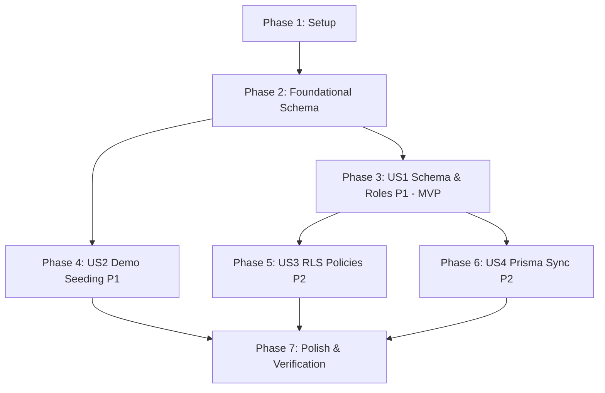

# Implementation Tasks: Supabase Auth Migrations, User Roles Schema & Demo Seed Script

**Feature**: Supabase Auth Migrations, User Roles Schema & Demo Seed Script ([SIAA-43](https://the-three-devsketeers.atlassian.net/browse/SIAA-43))  
**Branch**: `feat/SIAA-43-auth-migrations-seed` | **Date**: 2026-10-08  
**Specification**: [`specs/006-auth-migrations-seed/spec.md`](spec.md) | **Plan**: [`specs/006-auth-migrations-seed/plan.md`](plan.md)  

---

## Phase 1: Setup (Shared Infrastructure)

**Purpose**: Project database migration directory initialization and TypeScript domain types baseline.

- [X] T001 Ensure Supabase configuration and migration directory structure exist in `supabase/config.toml`
- [X] T002 [P] Update domain authentication types and profile interfaces in `lib/types/auth.ts`

---

## Phase 2: Foundational (Blocking Prerequisites)

**Purpose**: Core PostgreSQL types, profiles table definition, and signup triggers required by all user stories.

**⚠️ CRITICAL**: No user story tasks can begin until this foundational schema phase is complete.

- [X] T003 Create core database migration file establishing extensions, `user_role` enum, and `public.profiles` table in `supabase/migrations/20261008000000_auth_profiles.sql`
- [X] T004 [P] Implement automated profile provisioning trigger `handle_new_user()` and bind `on_auth_user_created` on `auth.users` in `supabase/migrations/20261008000000_auth_profiles.sql`

**Checkpoint**: Core database schema and automatic signup trigger ready — user story implementation can proceed.

---

## Phase 3: User Story 1 - Reproducible Database Schema & Role Provisioning (Priority: P1) 🎯 MVP

**Goal**: Deliver idempotent, reproducible database migrations creating user profiles, role hierarchy, and foreign key relations cleanly.

**Independent Test**: Execute `supabase db reset` or apply migrations on a clean database and verify tables, enums, and foreign keys are created without errors.

### Implementation for User Story 1

- [X] T005 [US1] Add performance indexes (`idx_profiles_role`, `idx_profiles_email`) and schema comments in `supabase/migrations/20261008000000_auth_profiles.sql`
- [X] T006 [US1] Verify idempotent migration execution and migration reset handling in `supabase/migrations/20261008000000_auth_profiles.sql`

**Checkpoint**: Database schema and role definitions are reproducible and testable independently.

---

## Phase 4: User Story 2 - Out-of-the-Box Demo Persona Provisioning (Priority: P1)

**Goal**: Provision instantly authenticatable demo accounts (`admin@swift.local` and `cashier@swift.local` with password `swift123`) with confirmed email status.

**Independent Test**: Execute `supabase/seed.sql` and verify demo personas can log in on the `/login` portal with valid session generation.

### Implementation for User Story 2

- [X] T007 [US2] Implement idempotent demo account seeding for `admin@swift.local` and `cashier@swift.local` using `pgcrypto` in `supabase/seed.sql`
- [X] T008 [P] [US2] Populate `auth.identities` records for seeded demo users to support email auth provider lookup in `supabase/seed.sql`
- [X] T009 [US2] Ensure initial `public.profiles` records for seeded users with exact roles (`admin` and `cashier`) and active status in `supabase/seed.sql`

**Checkpoint**: Demo accounts exist, emails are pre-confirmed, and users can authenticate immediately.

---

## Phase 5: User Story 3 - Role-Based Data Isolation & Profile Security (Priority: P2)

**Goal**: Enforce strict Row Level Security (RLS) policies guaranteeing privacy and role boundaries across profiles.

**Independent Test**: Query `public.profiles` under `anon`, authenticated staff, and admin roles to verify access isolation and boundary enforcement.

### Implementation for User Story 3

- [X] T010 [US3] Implement `public.is_admin()` security helper function with `SECURITY DEFINER` and restricted `search_path` in `supabase/migrations/20261008000000_auth_profiles.sql`
- [X] T011 [US3] Configure RLS table enablement, Data API grants, and optimized SELECT policies (self-read and admin-read-all) in `supabase/migrations/20261008000000_auth_profiles.sql`
- [X] T012 [P] [US3] Configure UPDATE RLS policies with matching `USING` and `WITH CHECK` clauses preventing unauthorized role modification in `supabase/migrations/20261008000000_auth_profiles.sql`

**Checkpoint**: RLS policies protect profile records against IDOR and unauthorized role elevations.

---

## Phase 6: User Story 4 - Data Model Alignment & Application Contract Sync (Priority: P2)

**Goal**: Synchronize `prisma/schema.prisma` and application contracts with the database profile table and role enums.

**Independent Test**: Run `npx prisma validate` and verify TypeScript compilation with Prisma client.

### Implementation for User Story 4

- [X] T013 [P] [US4] Update `prisma/schema.prisma` with `Profile` model mapping to `profiles` table and `UserRole` enum in `prisma/schema.prisma`
- [X] T014 [US4] Run Prisma schema validation and generate updated Prisma client in `prisma/schema.prisma`
- [X] T015 [P] [US4] Export aligned database profile type helpers and re-export in `lib/types/index.ts`

**Checkpoint**: Prisma ORM schema and TypeScript domain types match the database migration contracts.

---

## Phase 7: Polish & Cross-Cutting Concerns

**Purpose**: Verification, linting, and end-to-end integration across all stories.

- [X] T016 [P] Verify documentation links and references in `specs/006-auth-migrations-seed/quickstart.md`
- [X] T017 Execute end-to-end database reset and migration verification per `quickstart.md` scenarios
- [X] T018 Run TypeScript compilation check (`npx tsc --noEmit`) and linting (`npm run lint`) to ensure zero regressions

---

## Dependencies & Execution Order

### Phase Dependencies

- **Setup (Phase 1)**: Can start immediately.
- **Foundational (Phase 2)**: Depends on Setup completion. **BLOCKS** all user stories.
- **User Story 1 (Phase 3)**: Depends on Foundational completion.
- **User Story 2 (Phase 4)**: Depends on Foundational completion (can run sequentially or in parallel with US1).
- **User Story 3 (Phase 5)**: Depends on Foundational completion and US1.
- **User Story 4 (Phase 6)**: Depends on Foundational schema and US1 completion.
- **Polish (Phase 7)**: Depends on completion of all user stories.

### User Story Dependencies



### Parallel Opportunities

- Within Phase 1: `T002` can run in parallel with `T001`.
- Within Phase 2: `T004` can be drafted alongside `T003`.
- Within Phase 4: `T008` can be drafted alongside `T007`.
- Within Phase 5: `T012` can be drafted alongside `T011`.
- Within Phase 6: `T013` and `T015` can be prepared in parallel.

---

## Parallel Example: User Story 2 & 4

```bash
# Seeding tasks in User Story 2 can be developed alongside Prisma definitions in User Story 4:
Task: "Populate auth.identities records in supabase/seed.sql" (T008)
Task: "Update prisma/schema.prisma with Profile model and UserRole enum" (T013)
```

---

## Implementation Strategy

### MVP First (User Story 1 & Foundational Schema)

1. Complete Phase 1: Setup.
2. Complete Phase 2: Foundational.
3. Complete Phase 3: User Story 1 (Schema & Roles).
4. **VALIDATE**: Run `supabase db reset` or apply migration to verify table creation.

### Incremental Delivery

1. Foundation + US1 → Core tables & types ready.
2. US2 → Demo accounts seeded and login verifiable via `/login`.
3. US3 → Strict RLS security policies enforced.
4. US4 → Prisma ORM and TypeScript models synchronized.
5. Polish → Verification against `quickstart.md` scenarios, clean lint, zero type errors.
