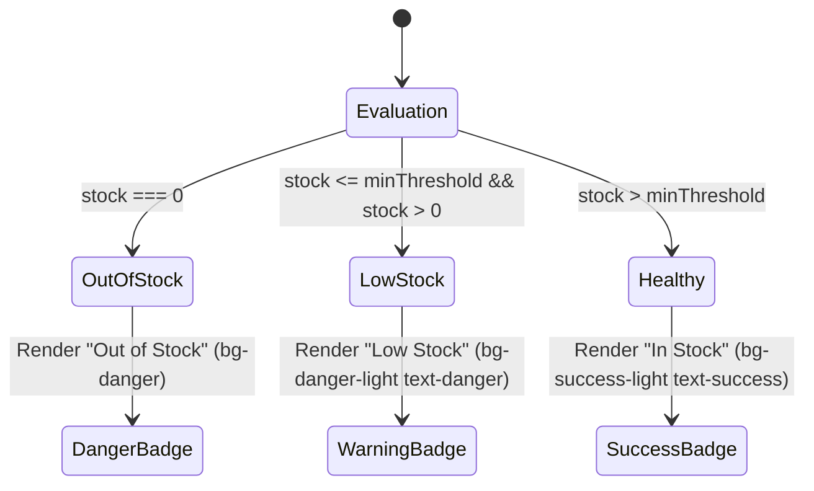

# Data Model: Master Parts Catalog & Search Filtering

**Feature**: `Master Parts Catalog & Multi-Attribute Search Filtering`
**Ticket**: `SIAA-13`
**Created**: 2026-10-09

---

## 1. Domain Entities & Storage Models

### Product (Existing Domain Entity in `@/lib/types/product.ts`)
The catalog operates directly on the core `Product` model:

| Field | Type | Description | Example |
| :--- | :--- | :--- | :--- |
| `sku` | `string` | Unique part identifier | `"YAM-NMAX-BL01"` |
| `name` | `string` | Part title | `"OEM Front Brake Pads"` |
| `category` | `ProductCategory` | Subsystem classification | `"Brakes"` |
| `stock` | `number` | Active warehouse inventory count | `2` |
| `minThreshold` | `number` | Restock warning threshold | `5` |
| `location` | `string` | Physical rack/shelf coordinates | `"Rack A-01 / Shelf 2"` |
| `cost` | `number` | Unit acquisition cost (PHP) | `280` |
| `wholesale` | `number` | Wholesale unit price (PHP) | `380` |
| `retail` | `number` | Retail counter price (PHP) | `450` |
| `oem` | `boolean` | Genuine OEM indicator | `true` |
| `model` | `string` | Target fitment model | `"Yamaha NMAX 155"` |
| `brand` | `string` | Manufacturer name | `"Yamaha Genuine Parts"` |
| `description` | `string?` | Optional part details | `"Front caliper brake pad set"` |
| `imageUrl` | `string?` | Optional product thumbnail | `"/images/parts/yam-pad.png"` |

---

## 2. Client Filter State & UI DTOs

### CatalogFilterState
Maintains the active filter selections in the catalog view:

```typescript
export type StockFilterOption = 'all' | 'in_stock' | 'low_stock' | 'out_of_stock';

export interface CatalogFilterState {
  searchQuery: string;
  category: string;
  stockStatus: StockFilterOption;
  sortBy?: 'name' | 'sku' | 'stock' | 'retail';
  sortOrder?: 'asc' | 'desc';
}
```

### CatalogStats (Summary KPI DTO)
Computed summary statistics displayed on header metric cards:

```typescript
export interface CatalogStats {
  totalSkus: number;
  lowStockCount: number;
  outOfStockCount: number;
  totalValuation: number;
  categoriesCount: number;
}
```

---

## 3. Stock Health Classification State Machine

For each product, the stock health badge is computed deterministically:



| State | Condition | Badge Variant | Text Display |
| :--- | :--- | :--- | :--- |
| **Out of Stock** | `stock === 0` | `badge-critical` (`bg-danger text-text-light`) | `0 Units (Out of Stock)` |
| **Low Stock** | `0 < stock <= minThreshold` | `badge-danger` (`bg-danger-light text-danger`) | `{stock} Units (Low Stock)` |
| **Healthy** | `stock > minThreshold` | `badge-success` (`bg-success-light text-success`) | `{stock} Units in Stock` |
